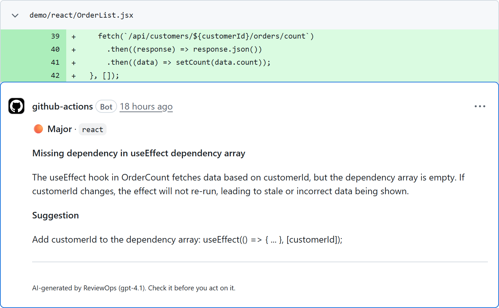

# ReviewOps

ReviewOps is a GitHub Action that reviews pull requests with an AI model. It starts on new and updated pull requests, reads the diff through the GitHub API, sends it to the OpenAI API and posts the feedback as one review with inline comments at the code it is about.



- **Focus areas:** code quality, React, Vue, EF Core and security. Each finding has a severity (`critical`, `major`, `minor`, `info`) and a category.
- **Only the added lines get comments.** The action calculates the line numbers itself. A line number from the model counts only if the diff shows that line.
- **Repeated runs stay quiet.** A new push reviews only what is new and never repeats a comment.
- **It never decides about a merge.** The review has the type `COMMENT`, never `APPROVE` or `REQUEST_CHANGES`. You can let the step fail on open findings with `fail-on`.
- **Feedback in your language.** Twelve languages are supported (`language`).

**ReviewOps sends the diff of your pull request, with the path of each file, to the OpenAI API.** Read [Security & privacy](#security--privacy) before you use ReviewOps on code that must not leave your organisation.

## Quick start

1. **Create an OpenAI API key** in your OpenAI account.
2. **Store it as a secret.** In your repository open **Settings**, then **Secrets and variables**, then **Actions**, choose **New repository secret**, enter the name `OPENAI_API_KEY` and paste the key.
3. **Add the workflow.** Create the file `.github/workflows/reviewops.yml` with this content. The tag `@v1` exists once the first release is made ([docs/release.md](docs/release.md)); until then, pin the action to a commit of `main` as described under [Pinning to a commit](#pinning-to-a-commit):

```yaml
name: ReviewOps

on:
  pull_request:
    types: [opened, synchronize, reopened, ready_for_review, unlabeled]

# The token of this workflow may read the code and write reviews, nothing else.
permissions:
  contents: read
  pull-requests: write

# A newer push makes the review of the older one pointless. A change of labels
# does not: its run leaves out the review, and it must not cancel a review that
# is running.
concurrency:
  group: reviewops-${{ github.event.pull_request.number }}
  cancel-in-progress: ${{ github.event.action != 'unlabeled' }}

jobs:
  review:
    name: AI review
    runs-on: ubuntu-latest
    timeout-minutes: 15
    steps:
      - name: Review the pull request
        uses: lucalipsxstroons1/ReviewOps@v1
        with:
          openai-api-key: ${{ secrets.OPENAI_API_KEY }}
```

4. **Open a pull request.** The review appears a few seconds after the run of the workflow ends. No checkout is needed: the action reads the diff through the API.

The workflow needs the `pull_request` event. Use no other event: on any other event the action ends with a notice, and `pull_request_target` hands secrets to workflows of forks.

### Pinning to a commit

`@v1` follows the latest release of version 1. A tag can be moved to other code, so for a stricter setup pin the action to the full commit SHA of a release and keep the version as a comment:

```yaml
uses: lucalipsxstroons1/ReviewOps@<full-commit-sha> # v1.0.0
```

Until the first release exists, there is no `v1` and no release commit. Use the SHA of a commit of `main` and write `# main` as the comment.

### Using the result in later steps

The step sets outputs, and `fail-on` lets it fail on open findings. Give the step an `id`, and pass the outputs to later steps through `env`, never as an expression inside the command:

```yaml
name: ReviewOps

on:
  pull_request:
    types: [opened, synchronize, reopened, ready_for_review, unlabeled]

permissions:
  contents: read
  pull-requests: write

concurrency:
  group: reviewops-${{ github.event.pull_request.number }}
  cancel-in-progress: ${{ github.event.action != 'unlabeled' }}

jobs:
  review:
    name: AI review
    runs-on: ubuntu-latest
    timeout-minutes: 15
    steps:
      - name: Review the pull request
        id: review
        uses: lucalipsxstroons1/ReviewOps@v1
        with:
          openai-api-key: ${{ secrets.OPENAI_API_KEY }}
          fail-on: critical

      - name: Show the result
        if: always()
        env:
          FINDINGS_COUNT: ${{ steps.review.outputs.findings-count }}
          CRITICAL_COUNT: ${{ steps.review.outputs.critical-count }}
          REVIEW_URL: ${{ steps.review.outputs.review-url }}
        run: |
          echo "Open findings: $FINDINGS_COUNT, critical: $CRITICAL_COUNT, review: ${REVIEW_URL:-none}"
```

## Inputs

| Name | Required | Default | Description |
|---|---|---|---|
| `openai-api-key` | yes | | OpenAI API key. Pass it from a repository secret, never as plain text. |
| `github-token` | no | `${{ github.token }}` | Token used to read the pull request and post the review. It needs `pull-requests: write`. The token of the workflow run is enough. A personal access token makes the action fail to recognise its own earlier comments. |
| `openai-model` | no | `gpt-6-luna` | OpenAI model that writes the review, for example `gpt-6-luna` or `gpt-6.1-sol`. It has to support Structured Outputs. A model with a low token limit per minute can fail on large pull requests. |
| `language` | no | `en` | Language of the feedback: `en`, `de`, `fr`, `es`, `it`, `pt`, `nl`, `pl`, `tr`, `ja`, `zh` or `ko`. Code, identifiers, file paths, severities and categories stay in English. |
| `exclude` | no | empty | More glob patterns for files to leave out, one per line. They extend the built-in list (lockfiles, build output, generated code, binary files). A pattern without a slash applies in every directory, a pattern with a slash from the root of the repository. At most 50 patterns, and no negation, braces, parentheses or backslashes. A pattern has at most two `*` and two `**`. |
| `max-files` | no | `50` | Maximum number of files that are reviewed, from 1. Files after the limit are skipped and named in the log. |
| `max-diff-chars` | no | `200000` | Maximum size of the diffs that are reviewed, counted in characters of the annotated diff, from 1. A file that no longer fits is skipped. 200000 is about 50000 to 65000 tokens. |
| `max-comments` | no | `10` | Maximum number of findings the review shows, from 1. The most serious come first. Findings at a line of the diff become inline comments, the others are listed in the text of the review. |
| `fail-on` | no | `none` | Lets the step fail when open findings reach this severity: `none`, `critical` or `major` (`major` includes `critical`). The step fails only after the review is posted. |
| `review-drafts` | no | `false` | Whether draft pull requests are reviewed: `true` or `false`. A draft is left out by default, and the review starts when it is marked ready for review ([Skipping pull requests](#skipping-pull-requests)). |
| `skip-label` | no | `no-ai-review` | Name of a label that leaves out the review of a pull request that has it, without regard to case, at most 50 characters. Empty switches the label off. |
| `review-bots` | no | `false` | Whether pull requests that a bot opened, such as Dependabot, are reviewed: `true` or `false`. They are left out by default. |
| `insights-url` | no | empty | Address that receives a report with the key figures of every review, for [ReviewOps Insights](#reporting-to-reviewops-insights). Only `https` (`http` for `localhost` and `127.0.0.1`), at most 2048 characters, without credentials, query or fragment. Empty switches the report off. |
| `insights-secret` | no | empty | Secret that signs the report, the same value as `INGEST_SECRET` at ReviewOps Insights. At least 32 visible ASCII characters. Required when `insights-url` is set. Pass it from a repository secret. |

## Outputs

| Name | Description |
|---|---|
| `findings-count` | Number of open findings: the findings of this run and the earlier comments of ReviewOps whose line has not changed and whose thread is not resolved. |
| `critical-count` | Number of open findings with the severity `critical`, counted like `findings-count`. |
| `review-url` | Address of the review that this run posted. Empty when the run posted no review. |

A run that fails with an error sets no output. Every run also writes a job summary with the reviewed and the skipped files, the open findings by severity and the tokens that were used.

## Skipping pull requests

ReviewOps leaves out the review, and asks no model, in these cases. The first one that applies counts, and the log says which:

1. The pull request has the label `no-ai-review` (input `skip-label`, without regard to case).
2. The pull request is a draft (input `review-drafts` is `false`).
3. A bot opened the pull request (input `review-bots` is `false`). The author of the pull request counts, not who pushed last.
4. The event is the removal of a label other than the skip label.

The example workflow listens to `ready_for_review` and `unlabeled` for this. A draft that is marked ready gets its first, full review. A pull request gets its review when the skip label is taken off. When you re-run an old run, it reads the labels from the event of that run, not the labels the pull request has now.

A run that leaves out the review ends green with a notice, and posts nothing. It still reads the earlier reviews, counts their open findings, sets the outputs and applies `fail-on`: a label can be set by anyone with the role Triage, and it must not turn a red check green. A run that leaves out the review needs no OpenAI key. The example workflow does not cancel a running review when a label changes.

Pull requests of Dependabot are bot pull requests. To have them reviewed, set `review-bots: true` and store the key as a Dependabot secret as well.

## Reporting to ReviewOps Insights

[ReviewOps Insights](https://github.com/lucalipsxstroons1/ReviewOps-Insights) is a dashboard for the cost and quality of reviews across many repositories. The action can send it a small report at the end of every review. **It is off by default:** without `insights-url`, the action makes no request except to GitHub and OpenAI.

The report holds key figures only: repository, pull request number, model, token usage, duration, and the severity, category and file path of each finding. It never holds code, a diff, a text of the model, or the title of the pull request. [SECURITY.md](SECURITY.md) lists every field, and [docs/insights-payload.md](docs/insights-payload.md) is the contract.

To switch it on, store the address as a repository variable `INSIGHTS_URL` (**Settings**, **Secrets and variables**, **Actions**, **Variables**) and the secret as a repository secret `INSIGHTS_SECRET`, with the same value as `INGEST_SECRET` at your Insights instance, then pass both to the action:

```yaml
name: ReviewOps

on:
  pull_request:
    # "closed" lets the action send the final state of the findings (merged or
    # not). A run on a closed pull request reviews nothing.
    types: [opened, synchronize, reopened, ready_for_review, unlabeled, closed]

permissions:
  contents: read
  pull-requests: write

concurrency:
  group: reviewops-${{ github.event.pull_request.number }}
  cancel-in-progress: ${{ github.event.action != 'unlabeled' }}

jobs:
  review:
    name: AI review
    runs-on: ubuntu-latest
    timeout-minutes: 15
    steps:
      - name: Review the pull request and report to Insights
        uses: lucalipsxstroons1/ReviewOps@v1
        with:
          openai-api-key: ${{ secrets.OPENAI_API_KEY }}
          insights-url: ${{ vars.INSIGHTS_URL }}
          insights-secret: ${{ secrets.INSIGHTS_SECRET }}
```

- **Where it goes.** The report goes to the address you set, and nowhere else. A wrong address would hand repository names and file paths to a stranger, so the action checks it before the first request: `https` only, no credentials, no query, no fragment. The log names the host.
- **Signed.** The report is signed with the secret (HMAC-SHA256). The secret itself is never sent.
- **When.** After every run that asked the model, also when it found nothing. A run that leaves out the review, finds nothing new or fails sends nothing.
- **It never breaks the run.** If the report does not arrive (wrong secret, server down, redirect), the step shows a warning with the status and ends as it would have ended without Insights, also with `fail-on`. The action tries up to three times, with the same report each time, so Insights stores it once.
- **Forks and Dependabot.** GitHub passes them no repository secrets. The review still takes place, and the log says that no report was sent.

### What became of the findings

A second, smaller report tells Insights what became of the findings of earlier runs, so that it can show how useful the reviews are. For each earlier inline comment of the action it holds the fingerprint of the line and three truth values: whether the line is unchanged, whether the thread is resolved, and whether the comment has a 👎. It never holds a text, a name, a number of reactions or code.

- **A 👎 on a comment counts as a false alarm.** Insights shows such findings as false positives. Anyone who may react to the pull request can set it; in a public repository that is every GitHub user.
- **When.** At the end of every run that has an earlier finding to report, and, if the workflow also runs on `closed` (as in the example above), when the pull request is merged or closed. That run asks no model, needs no OpenAI key, posts nothing and changes no comment: it only sends the final state. A closed pull request is never reviewed, whichever event started the run.
- **Address.** Derived from `insights-url`: a path that ends on `/review` becomes `/status`. For any other path no status report is sent, and the log says so.
- **Limits.** Findings in the text of a review (without a line) are not reported, and a finding whose state cannot be determined (a file without a text diff, an unreadable thread) is left out. Insights then shows it as open. The state follows at the next run or when the pull request closes: there is no event for a resolved thread or a 👎.
- **Without `insights-url`** nothing changes, and the action makes no additional request to GitHub.

## How it works

1. The action reads the changed files of the pull request through the GitHub API and leaves out files that are not worth a review (lockfiles, build output, generated code, binary files) and every file that may hold secrets.
2. It masks strings that look like secrets, applies the limits and groups the files into requests of at most 50000 characters. Up to four requests run at the same time.
3. The model answers in a fixed format. The action checks every finding against the diff and keeps only the ones at a line it can comment.
4. It posts one review. A run without findings posts nothing.

## Security & privacy

**ReviewOps sends the diff of your pull request, with the path of each file, to the OpenAI API.** That is a part of your code: the changed lines and a few lines around them, not the whole file. What OpenAI does with it depends on the terms of your OpenAI account and the data controls of the project of your key.

- **Never sent:** files that may hold secrets (`.env*`, key and certificate files, `id_rsa*`, `.npmrc`, `.netrc`, `credentials.json`, `secrets.*` and a few more), under their new and their old name. The list is fixed, and no input can change it. The title, the description and the author of the pull request are not sent either.
- **Masked before sending:** strings that look like GitHub tokens, OpenAI keys, AWS access key IDs, Slack tokens, Stripe live keys, Google API keys and private keys. This is a safety net, not a guarantee. If a pull request contains a real secret, treat it as leaked.
- **Rights:** the workflow needs `contents: read` and `pull-requests: write`, nothing else.
- **Insights, only if you switch it on:** with `insights-url`, a report with key figures (never code, never a text of the model) goes to the address you set, and a second, smaller report with the fingerprint of each earlier finding and three truth values (line unchanged, thread resolved, 👎). Without it, nothing leaves the runner except the requests to GitHub and OpenAI.
- **Forks and Dependabot:** GitHub passes no secrets to workflows of pull requests from forks, and runs started by Dependabot get only the Dependabot secrets. The run then ends green with a notice and no review. A green run does not mean that the pull request was reviewed.
- **The answer of the model is untrusted.** It is checked, cut to a fixed length and made safe for Markdown before it is posted: no link, image, HTML or mention gets through. The action never approves a pull request and never requests changes.
- **Not in the log:** the prompt, the answer of the model, the content of a diff, the title of the pull request and every key.

[SECURITY.md](SECURITY.md) describes this in detail and says how to report a vulnerability.

## Costs & limits

You pay OpenAI for the tokens of every run. ReviewOps itself is free. Current prices are on the [pricing page of OpenAI](https://openai.com/api/pricing/); this page names no prices, because they change.

What the end-to-end tests of this repository measured (see [docs/e2e.md](docs/e2e.md)):

- A small diff of one file took about 1800 input tokens and 20 to 230 output tokens, and the job ran 6 to 18 seconds.
- 50 small files in one request took 4082 input and 32 output tokens.
- The upper bound is set by `max-diff-chars`: 200000 characters are about 50000 to 65000 input tokens, plus the system prompt for every request.

The limits that keep a run small:

| Limit | Value |
|---|---|
| Files per run | `max-files`, 50 by default |
| Diff size per run | `max-diff-chars`, 200000 characters by default |
| Findings in the review | `max-comments`, 10 by default |
| One request to the model | at most 50000 characters; a larger file is not reviewed |
| Requests at the same time | 4 |
| Time of the job | `timeout-minutes: 15` in the example workflow |

Files and findings over a limit are left out. The log and the job summary say which. The default model `gpt-6-luna` was chosen by a comparison on twelve pull requests ([#41](https://github.com/lucalipsxstroons1/ReviewOps/issues/41)): it costs about a fourteenth of `gpt-6.1-sol` per review and finds nearly as many documented defects. `gpt-4o-mini` missed security defects that both newer models found and is no longer the default.

## Known limitations

- The model sometimes raises a false alarm, for example for code in a test that shows an attack on purpose ([#61](https://github.com/lucalipsxstroons1/ReviewOps/issues/61)).
- For a defect inside a method, the comment can sit at the head of the method and not at the faulty line ([#70](https://github.com/lucalipsxstroons1/ReviewOps/issues/70)).
- The model finds only part of the real defects. In the comparison of #41, the default model found 4 of 12 documented defects in at least two of three runs, and 7 of 9 defects in real projects were found by no model. Treat the review as a help, not as a check.
- With a personal access token as `github-token`, the action does not recognise its own comments and reviews the whole pull request on every run.
- A run without findings posts no review, so it leaves the starting point of the next run where it was.

## License

[MIT](LICENSE)
